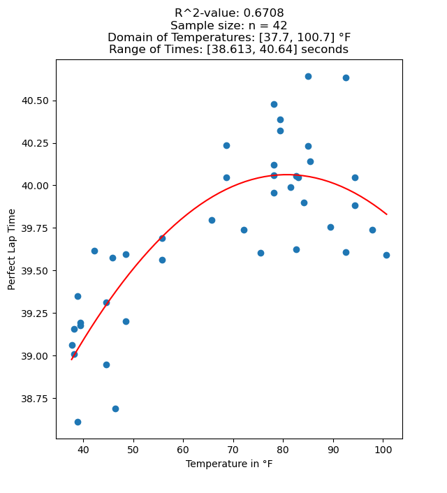

# How this Model and the Calculation Works

## Open-Meteo

"[Open-Meteo](https://open-meteo.com) partners with national weather services to bring you open data with high resolution, ranging from 1 to 11 kilometers. Open-Meteo's powerful APIs intelligently select the most suitable weather models for your specific location, ensuring accurate and reliable forecasts."

Open-Meteo's weather API is the source of the all the temperature data for each perfect lap data point. When new perfect laps are added to the model, buildModel.py makes the API calls necessary to gather the temperature data for the new perfect laps. These data points are stored in a CSV file that can build the regression model.

## Vegas Superkarts
[Vegas Superkarts](https://vegassuperkarts.com) is the home racetrack of Alexander Blake. As a Sodi World Series track, it is the perfect test ground to build this model, work out the bugs, and provide the Vegas drivers an impactful tool on their performance.

## Planned Features
One requested feature is to add track evolution analysis. Track evolution is a critical componenent to drivers qualifying times. The track will evolve due to the amount of drivers on the track and how many laps the drivers do.

Basically, as more and more laps are completed over the course of the race day, the track will evolve towards peak grip levels giving drivers the confidence to get the most out of the kart.

The model will need to take in the data of the fastest laps of a session and how it changed throughout the session as well as what session of the day the session was.

## Quadratic Regression Model
A quadratic regression model is used because experience tells us that there is an optimal temperature window for peak performance.

